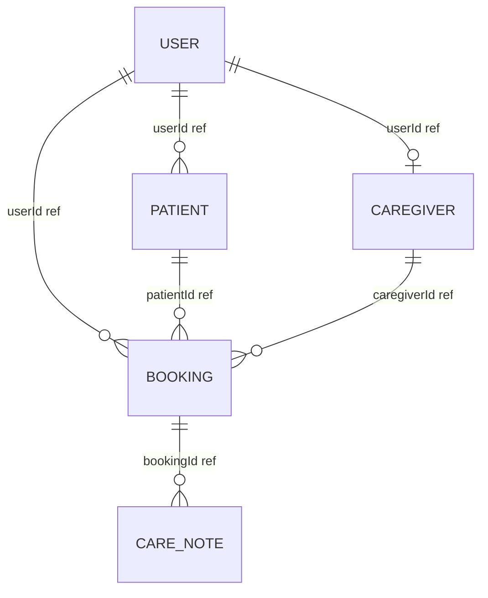

# 🩺 ElderCare

> **Professional Elderly Nursing & Healthcare Platform**
> Connect with verified nurses, caregivers, physiotherapists, and attendants for quality in-home elderly care services. Trusted by 10,000+ families.

---

## 🌟 Overview

**ElderCare** is a modern, premium digital healthcare platform built with **Next.js 16**, **MongoDB**, **Mongoose**, and **NextAuth.js**. It bridges the gap between families requiring reliable, high-quality care for their elderly relatives and certified, professional healthcare caregivers. 

Designed with rich, responsive aesthetics, modern typography, and a powerful dashboard-driven architecture, ElderCare ensures patient safety, transparent scheduling, and seamless real-time tracking of patient vitals and daily care activities.

---

## 🚀 Key Features

### 👤 1. Client / Family Portal
- **Patient Registration**: Securely add and manage elderly relatives' profiles, complete with age, medical conditions, allergies, and emergency contact details.
- **Service Discovery**: Browse specialized in-home care services (Nursing Care, Daily Attendant, Physiotherapy, Post-Hospital Care) with transparent pricing (Hourly, Daily, Monthly).
- **Caregiver Browsing**: View caregiver profiles showcasing qualifications, years of experience, languages spoken, ratings, and bios.
- **Booking Management**: Request services, specify booking types (hourly, daily, or long-term), monitor status workflows (Pending ➔ Accepted ➔ In-Progress ➔ Completed), and leave ratings and reviews.
- **Vitals Dashboard**: Monitor logged daily vitals (BP, temperature, pulse) and review daily notes uploaded by the active caregiver.

### 💼 2. Caregiver Portal
- **Booking Board**: Manage care requests, accept or reject incoming bookings, and track current assignments.
- **Log Daily Vitals**: Input real-time patient health details (Blood Pressure, Pulse, Temperature) directly into the care logs.
- **Progress Notes**: Write and upload daily logs summarizing the patient's mood, physical condition, and activities.
- **Availability Profiles**: Set and update shift hours, days of availability, and custom pricing tiers.

### 🛡️ 3. Admin Control Center
- **System Metrics**: Track key metrics in real-time (Total registered users, certified caregivers, active bookings, overall revenue).
- **Service Editor**: Add, modify, or deactivate specialized healthcare service items.
- **Caregiver Verification**: Verify credentials and credentials documents to ensure high-quality, trusted care.

---

## 🛠️ Technical Stack

- **Framework**: [Next.js 16](https://nextjs.org/) (App Router, Server Actions, Serverless API Routes)
- **Runtime & Library**: React 19, Lucide React (premium vector icons)
- **Styling**: Premium Vanilla CSS3 with customized layout systems (CSS variables, glassmorphism, responsive grids, and subtle micro-animations)
- **Database**: MongoDB Atlas with Mongoose (Strict validation schemas and automatic timestamps)
- **Authentication**: NextAuth.js (Session-based auth, custom provider configurations, password hashing via bcryptjs)

---

## 📊 Database Models & Architecture

The application implements a robust, normalized MongoDB database schema using Mongoose:



### 1. `User` Schema
- Handles registration, authentication, and core profile info.
- **Roles**: `user` (Client), `caregiver`, `admin`.
- Pre-save bcrypt hooks for secure password hashing.

### 2. `Caregiver` Schema
- Extended profile details linked to the `User` document.
- Fields: `specialization` (nursing, attendant, physiotherapy, post-hospital), `qualifications`, `experience`, `serviceAreas`, `hourlyRate`, `dailyRate`, `monthlyRate`, `isVerified`, `rating`, and `availability`.

### 3. `Patient` Schema
- Detailed records of the elderly patient being registered by the Client.
- Fields: `name`, `age`, `gender`, `medicalConditions` (array), `allergies` (array), `emergencyContact` (`name`, `phone`, `relation`), and `specialNotes`.

### 4. `Booking` Schema
- Manages care service workflows.
- Fields: `userId`, `patientId`, `caregiverId`, `serviceId`, `bookingType` (hourly, daily, long-term), `startDate`, `endDate`, `status` (`pending`, `accepted`, `in-progress`, `completed`, `cancelled`), `totalAmount`, `rating`, and `review`.

### 5. `CareNote` Schema
- Daily updates and vitals logged by caregivers on active bookings.
- Fields: `bookingId`, `caregiverId`, `note` (text), `vitals` (`bp`, `temperature`, `pulse`), and `timestamp`.

---

## 📁 File Structure

```text
eldercare/
├── src/
│   ├── app/                 # Next.js App Router Pages & API Routes
│   │   ├── about/           # About Us Page
│   │   ├── admin/           # Admin Dashboard & Verification
│   │   ├── api/             # Backend endpoints (Users, Patients, Caregivers, Bookings)
│   │   │   └── seed/        # Database initialization & sample seeding
│   │   ├── caregiver/       # Caregiver Workspace & Booking Logger
│   │   ├── dashboard/       # Client/User Workspace & Booking Flow
│   │   ├── login/           # Authentication Login
│   │   ├── register/        # Authentication Registration
│   │   ├── services/        # Service Listings page
│   │   ├── globals.css      # Core Design System CSS Variables & Utilities
│   │   ├── layout.js        # Root HTML shell, providers, and headers
│   │   └── page.js          # Interactive home landing page
│   ├── components/          # Reusable UI Components
│   │   ├── AuthProvider.js  # NextAuth session context wrapper
│   │   ├── BookingCard.js   # Dynamic card for booking statuses
│   │   ├── CaregiverCard.js # Profile card for caregiver listings
│   │   ├── Navbar.js        # Custom responsive header navigation
│   │   ├── StatsCard.js     # Admin metrics visualization blocks
│   │   └── StatusBadge.js   # Colored badge helper for workflow states
│   ├── lib/                 # Core helper scripts & configurations
│   │   ├── auth.js          # NextAuth configuration
│   │   ├── mongodb.js       # Mongoose Connection Pool Client
│   │   └── seed.js          # Sample data seeding logic
│   └── models/              # Strict Mongoose Schemas (User, Patient, etc.)
```

---

## ⚙️ Environment Configuration

Create a `.env.local` file in the root of the project with the following keys:

```env
# MongoDB Connection String (Local or MongoDB Atlas)
MONGODB_URI=mongodb://localhost:27017/eldercare

# NextAuth Configurations
NEXTAUTH_SECRET=your_32_character_jwt_secret_key
NEXTAUTH_URL=http://localhost:3000
```

---

## 🛠️ Installation & Setup

1. **Clone the repository and enter the directory**:
   ```bash
   git clone <github-repository-url>
   cd eldercare
   ```

2. **Install dependencies**:
   ```bash
   npm install
   ```

3. **Database Seeding**:
   Start your local MongoDB service (or connect to Atlas), start the Next.js development server (step 4), and execute a `GET` request to initialize the database with clean mock profiles, bookings, services, and caregivers:
   ```http
   GET http://localhost:3000/api/seed
   ```
   *(This API endpoint invokes `seedDatabase()` to populate your tables instantly with sample clients, caregivers, patients, services, and admin accounts.)*

4. **Run the development server**:
   ```bash
   npm run dev
   ```

5. **Open the web application**:
   Open [http://localhost:3000](http://localhost:3000) in your browser to view the application.

---

## 👤 Sample Accounts for Testing

After seeding the database, you can sign in using these default credentials:

- **Admin Account**:
  - Email: `admin@eldercare.com`
  - Password: `admin123`
- **Caregiver Account (Nurse)**:
  - Email: `anita@example.com`
  - Password: `caregiver123`
- **Client/Family User Account**:
  - Email: `rajesh@example.com`
  - Password: `user123`
